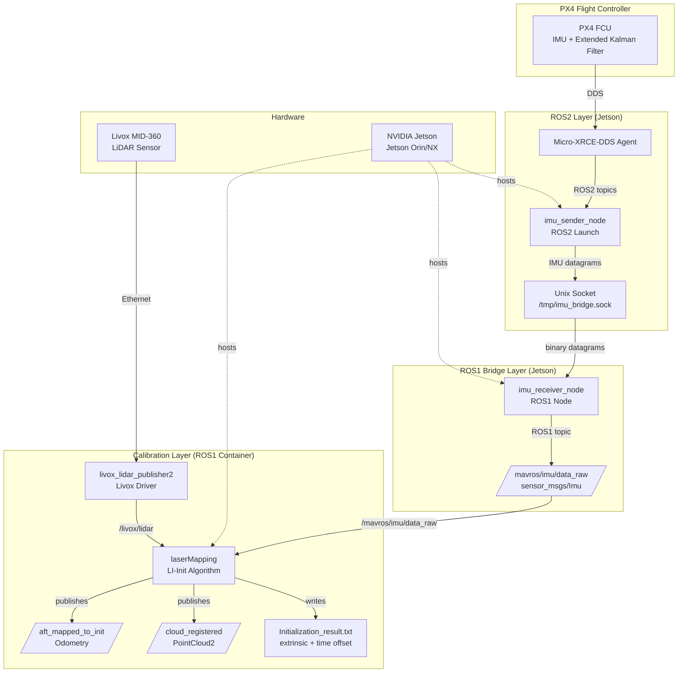
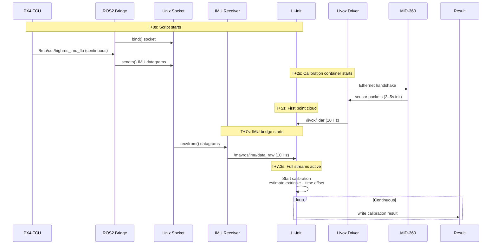
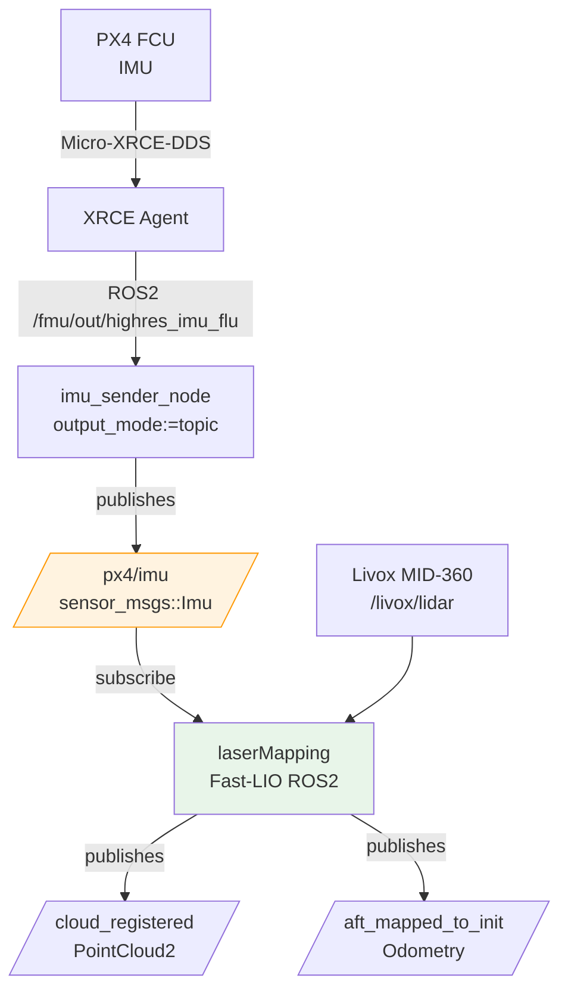
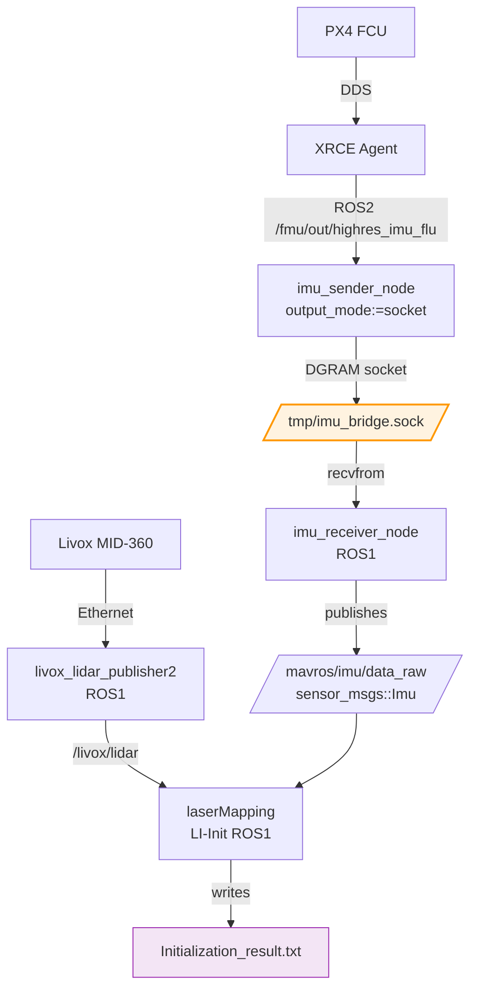
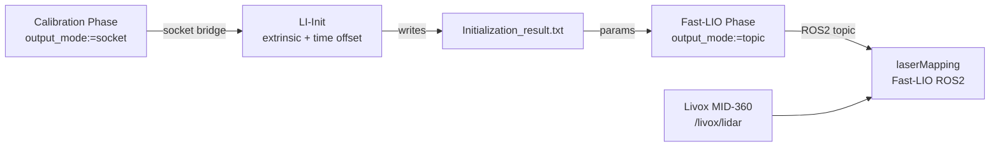

# Linker Module: LiDAR-IMU Calibration & LIO Pipeline

The **linker** module orchestrates PX4 flight controller IMU data (ROS2) for two use cases:

1. **LI-Init calibration** — bridged to ROS1 for LiDAR-IMU initialization (extrinsic + time offset)
2. **Fast-LIO odometry** — direct ROS2 topic for real-time LiDAR-inertial odometry

The `imu_sender_node` operates in one of two exclusive output modes:
- **Socket mode** (`output_mode:=socket`): Unix datagram socket `/tmp/imu_bridge.sock` → ROS1 bridge → LI-Init
- **Topic mode** (`output_mode:=topic`): ROS2 topic `/px4/imu` → direct subscription → Fast-LIO

> **Note**: Modes are mutually exclusive. To run calibration and LIO simultaneously with PX4 IMU, launch two separate `imu_sender_node` instances (one per mode) or use sequential operation. The integrated tmux script runs LIO with internal Livox IMU and calibration with PX4 via socket, avoiding the need for dual instances.

## Architecture Overview



## Component Breakdown

### 1. PX4 Connector (`px4_connector/`)

**Role**: ROS2 node that extracts IMU data from PX4 FCU and outputs in configurable format.

- **Image**: `vtol/px4-connector-jetson:latest`
- **Entry**: `ros2 launch imu_bridge sender.launch.py`
- **Node**: `imu_sender_node`
- **Input ROS2 Topics**:
  - `/fmu/out/highres_imu_flu` (`px4_msgs/msg/HighresImu`)
- **Outputs** (mode-dependent):
  - **Socket mode** (`output_mode:=socket`): Unix datagram socket `/tmp/imu_bridge.sock`
  - **Topic mode** (`output_mode:=topic`): ROS2 topic `/px4/imu` (`sensor_msgs/Imu`)
- **Parameters**:
  - `output_mode` (default: `topic`) — `topic` | `socket`
  - `socket_path` (default: `/tmp/imu_bridge.sock`) — used only in socket mode
  - `output_topic` (default: `/px4/imu`) — used only in topic mode
- **DDS**: FastRTPS with `fastdds-debug.xml` profile
- **ROS Domain**: `30`

### 2. IMU Bridge (`LiDAR_IMU_Init/imu_bridge_ros1/`)

**Role**: ROS1 receiver node (used only in LI-Init mode).

- **Part of**: `vtol/calib-lidar-imu-init-jetson:latest` image
- **Node**: `imu_receiver_node`
- **Input**: Unix datagram socket `/tmp/imu_bridge.sock`
- **Output ROS1 Topic**: `/mavros/imu/data_raw` (`sensor_msgs/Imu`)
- **Architecture**: 
  - **Receiver thread** polls socket @ ~10kHz → ring buffer (2000 messages)
  - **Publisher thread** pops from buffer → publishes at native ROS1 rate
- **Buffer strategy**: drops oldest if full (loss-tolerant for IMU stream)

### 3. Calibration Container (`LiDAR_IMU_Init/`)

**Role**: Runs Livox driver + LI-Init algorithm for LiDAR-IMU calibration (LI-Init mode only).

- **Image**: `vtol/calib-lidar-imu-init-jetson:latest`
- **Launch**: `roslaunch lidar_imu_init livox_mid360_integrated.launch`
- **Components**:
  - `livox_lidar_publisher2` — Livox MID-360 driver, publishes `/livox/lidar` @ 10 Hz
  - `laserMapping` (LI-Init) — subscribes to LiDAR + IMU, calibrates extrinsic & time offset
  - `imu_receiver_node` — ROS1 bridge from socket
- **Output file**: `/root/catkin_ws/src/LiDAR_IMU_Init/result/Initialization_result.txt`
- **Key ROS1 outputs**:
  - `/cloud_registered` — LIO odometry point cloud
  - `/aft_mapped_to_init` — full odometry with pose
  - `/Laser_map` — global map
  - `/cloud_registered_body` — body-frame point cloud

### 4. LIO Container (`lidar_connector/FAST_LIO_ROS2/`)

**Role**: Runs Fast-LIO odometry with direct PX4 IMU (ROS2 LIO mode).

- **Image**: `vtol/lio-jetson:latest`
- **Launch**: `ros2 launch fast_lio mapping.launch.py config_file:=fastlio_mid360.yaml`
- **Components**:
  - `livox_lidar_publisher2` (ROS2) — Livox MID-360 driver, `/livox/lidar`
  - `laserMapping` (Fast-LIO) — subscribes to `/livox/lidar` and `/px4/imu`, runs LIO
- **Config**: `fastlio_mid360.yaml` with `common.imu_topic: "/px4/imu"`
- **Outputs** (ROS2):
  - `/cloud_registered` — LIO point cloud
  - `/aft_mapped_to_init` — odometry with pose
  - `/Laser_map` — global map (optional)

### 5. Monitor & Shell

**Monitor** (`tmux` window): tails result file, shows Docker status, checks topic availability.

**Shell Access** (`tmux` windows): interactive bash inside each container with appropriate environment sourced (ROS1 for calib, ROS2 for px4-connector/LIO).

## Data Flow (Temporal Sequence)



## Inter-Process Communication

### Unix Socket Bridge (`/tmp/imu_bridge.sock`)

**Purpose**: Cross-distro ROS2→ROS1 IMU data transfer without ROS1-ROS2 bridge.

**Format**:
```c++
struct ImuData {
    uint64_t timestamp;   // nanoseconds (ROS time)
    float accel[3];       // m/s², FLU frame
    float gyro[3];        // rad/s, FLU frame
};
```

**Why Unix DGRAM?**
- Zero-copy, no connection lifecycle
- Low latency (fire-and-forget)
- Rate decoupling via ring buffer in receiver
- Loss-tolerant: IMU stream is dense; occasional drop OK for temporal alignment

**Shared via**: `--ipc=host` in both Docker containers.

### Topic Map Summary

#### LI-Init Mode (ROS2 → Unix Socket → ROS1)

| Layer | Direction | Topic | Type | Node |
|-------|-----------|-------|------|------|
| ROS2 | SUB | `/fmu/out/highres_imu_flu` | `HighresImu` | `imu_sender_node` |
| Socket | OUT | `/tmp/imu_bridge.sock` | binary DGRAM | `imu_sender_node` |
| Socket | IN | `/tmp/imu_bridge.sock` | binary DGRAM | `imu_receiver_node` |
| ROS1 | PUB | `/mavros/imu/data_raw` | `Imu` | `imu_receiver_node` |
| ROS1 | PUB | `/livox/lidar` | `PointCloud2` | `livox_lidar_publisher2` |
| ROS1 | SUB | `/livox/lidar` | `PointCloud2` | `laserMapping` |
| ROS1 | SUB | `/mavros/imu/data_raw` | `Imu` | `laserMapping` |
| ROS1 | PUB | `/cloud_registered` | `PointCloud2` | `laserMapping` |
| ROS1 | PUB | `/aft_mapped_to_init` | `Odometry` | `laserMapping` |

#### ROS2 LIO Mode (Direct Topic)

| Layer | Direction | Topic | Type | Node |
|-------|-----------|-------|------|------|
| ROS2 | SUB | `/fmu/out/highres_imu_flu` | `HighresImu` | `imu_sender_node` |
| ROS2 | PUB | `/px4/imu` | `Imu` | `imu_sender_node` |
| ROS2 | PUB | `/livox/lidar` | `PointCloud2` | `livox_lidar_publisher2` |
| ROS2 | SUB | `/livox/lidar` | `PointCloud2` | `laserMapping` |
| ROS2 | SUB | `/px4/imu` | `Imu` | `laserMapping` |
| ROS2 | PUB | `/cloud_registered` | `PointCloud2` | `laserMapping` |
| ROS2 | PUB | `/aft_mapped_to_init` | `Odometry` | `laserMapping` |

## Startup Sequence (tmux-based)

```mermaid
flowchart TD
    Start[run-jetson-prod-li-init-tmux.sh] --> ConfigGen[Generate runtime config<br/>discover IPs, render templates]
    ConfigGen --> Cleanup[Cleanup old containers<br/>kill host rosmaster on 11311]
    Cleanup --> TmuxStart[Start tmux session<br/>jetson-debug-li-init]
    
    TmuxStart --> W1[Window 1: PX4 Connector<br/>T+0s]
    TmuxStart --> W2[Window 2: Calibration<br/>T+1s]
    TmuxStart --> W3[Window 3: Monitor<br/>T+2s]
    TmuxStart --> W4[Window 4: Shell<br/>T+3s]
    
    W1 --> C1[px4-connector container<br/>ros2 launch imu_bridge sender.launch.py<br/>output_mode:=socket]
    C1 --> SOCKET1[imu_sender_node<br/>output_mode:=socket<br/>writes /tmp/imu_bridge.sock]
    
    W2 --> C2[calib container<br/>bash -c 'roslaunch ...& sleep 5<br/>rosrun imu_receiver_node']
    C2 --> S2_1[livox_lidar_publisher2<br/>MID-360 driver]
    C2 --> S2_2[laserMapping (LI-Init)<br/>waits for /livox/lidar + /mavros/imu]
    C2 --> S2_3[imu_receiver_node<br/>starts after 5s delay<br/>reads socket, publishes ROS1]
    
    W3 --> M1[monitor_tail.sh<br/>tail -f result file]
    W3 --> M2[docker ps<br/>container status]
    
    W4 --> SHELL[docker exec -it calib<br/>source ROS1 env]
    
    SOCKET1 -->|IMU datagrams| S2_3
    S2_1 -->|point clouds| S2_2
    S2_3 -->|IMU topic| S2_2
    S2_2 -->|writes| RESULT[Initialization_result.txt<br/>extrinsic R/T, time offset]
    
    RESULT --> DONE[✓ Calibration complete<br/>Ready for LIO]
```

**Dependency chain**:
1. `imu_sender_node` → socket must exist before `imu_receiver_node` starts
2. `livox_lidar_publisher2` must publish first point cloud (~5s after power-on)
3. `imu_receiver_node` starts 5s after LI-Init → LI-Init waits for IMU stream
4. Monitor polls result file every 2s; Shell waits for container readiness

## Output & Results

### Calibration Result File

```
/root/catkin_ws/src/LiDAR_IMU_Init/result/Initialization_result.txt
```

Format (example):
```
extrinsic_R: 0.001 -0.999 0.043 -0.005 0.043 0.999 0.999 0.002 -0.005
extrinsic_T: -0.023 0.187 0.342
time_offset: 0.127451
gravity: 0.012 -0.021 9.801
imu_bias: -0.032 0.009 0.005 0.0002 -0.0001 0.0003
```

- **extrinsic_R**: rotation quaternion (xyzw)
- **extrinsic_T**: translation vector (m) from IMU to LiDAR frame
- **time_offset**: temporal calibration (s), positive means LiDAR is ahead
- **gravity**: measured gravity vector (m/s²)
- **imu_bias**: accelerometer + gyroscope bias

### Downstream Usage

After calibration:
1. Copy values into FAST-LIO config (`fastlio_mid360.yaml`):
   ```yaml
   ext_T: [-0.023, 0.187, 0.342]
   ext_R: [0.001, -0.999, 0.043, -0.005, 0.043, 0.999, 0.999, 0.002, -0.005]
   time_diff_lidar_to_imu: 0.127451
   ```
2. Run integrated LIO+calibration pipeline for continuous odometry.

## Directory Structure

```
linker/
├── Makefile                          # Build + run targets (docker-build-*, docker-run-*)
├── IMU_BRIDGE_README.md             # Unix socket bridge spec
├── dockerfiles/                      # Docker build definitions
│   ├── assets/
│   │   ├── calib_entrypoint.sh       # Calibration container entrypoint
│   │   ├── calib_run.sh              # Calibration runner with bag support
│   │   ├── px4_connector_entrypoint.sh
│   │   └── px4_connector_debug_entrypoint.sh
│   ├── l4t_ros2_base.Dockerfile       # shared Jetson L4T + ROS2 Humble base
│   ├── lio.Dockerfile                 # native single-stage LIO build
│   ├── px4_connector.Dockerfile       # native single-stage PX4 connector build
│   ├── calib_lidar_imu_init.perp.Dockerfile   # legacy ROS1 prep stage
│   └── calib_lidar_imu_init.native.Dockerfile # legacy ROS1 native stage
│   ├── imu_bridge_ros1/              # ROS1 receiver node
│   │   └── src/imu_receiver.cpp
│   ├── src/lidar_imu_init/           # laserMapping node
│   ├── launch/livox_mid360_integrated.launch
│   ├── config/fastlio_mid360.yaml
│   ├── config/livox_mid360.json
│   ├── result/Initialization_result.txt (output)
│   └── image/                        # pipeline + excitation diagrams
└── run_scripts/                      # Entry scripts for Jetson
    ├── run-jetson-prod-li-init-tmux.sh      # main production pipeline
    ├── run-jetson-debug-li-init-tmux.sh      # debug mode (no auto-exit)
    ├── run-jetson-debug-linker-integrated-tmux.sh  # LIO+calib combined
    ├── tmux_utils.sh                  # tmux helper functions
    └── config/
        ├── fastdds-debug.xml          # FastDDS profile (ROS2)
        ├── livox_mid360.json.template  # Livox driver config template
        └── fastlio_mid360.yaml.template
```

## Build & Deploy

### Build Docker Images (from host)

```bash
cd linker

# Build the shared ROS2 base image once
make docker-build-base-jetson

# Build all three images from the host
make docker-build-px4-connector-jetson
make docker-build-calib-jetson
make docker-build-lio-jetson
```

**Build model**:
1. `docker-build-base-jetson` ships the repository with `rsync` and builds the shared L4T + ROS2 Humble base image on Jetson.
2. `docker-build-px4-connector-jetson` and `docker-build-lio-jetson` ship the repository with `rsync` and perform native single-stage builds on Jetson.
3. `docker-build-calib-jetson` keeps the existing prep + native flow because it still targets the ROS1 calibration stack.

### Run Production Pipeline

**LI-Init Calibration** (extract extrinsic + time offset):
```bash
cd run_scripts
./run-jetson-prod-li-init-tmux.sh
```
- Discovers LiDAR IP via ARP on `enP8p1s0`
- Generates `livox_mid360.json` + `fastlio_mid360.yaml` with discovered IPs
- Starts tmux session `jetson-debug-li-init` with 4 windows

> **Note**: The script launches `imu_sender_node` with default `output_mode:=topic`. For calibration to receive IMU data, edit the script (line ~84) to add `output_mode:=socket` to the launch command, or start `imu_sender_node` manually in a separate terminal with `ros2 launch imu_bridge sender.launch.py output_mode:=socket` before running the script.

**Bag Playback Mode** (offline calibration):
```bash
./run-jetson-prod-li-init-tmux.sh --bag /data/calibration.bag
```
- Replaces Livox driver with rosbag playback in calibration container

### Run Integrated Debug Session (LIO + Calibration)

After calibrating with LI-Init (or using known extrinsics):

```bash
cd run_scripts
./run-jetson-debug-linker-integrated-tmux.sh
```

This starts a 7-window tmux session (`jetson-debug-linker-integrated`):

1. **px4-connector** — PX4 → socket (`/tmp/imu_bridge.sock`) for calibration (must patch script to add `output_mode:=socket`)
2. **lio** — Livox driver + Fast-LIO consuming `/livox/imu` (internal IMU)
3. **calibration** — LI-Init reading from socket → produces calibration result
4. **monitor** — status dashboard
5–7. **shells** — exec access to each container

> **Important**: The px4-connector window runs in **topic mode by default** (no `output_mode` arg). For calibration to receive IMU data, edit the script (line ~132) to pass `output_mode:=socket`. The LIO window uses the Livox internal IMU, so it does not depend on the PX4 connector.

**Configuration**:
The script generates `fastlio_mid360.yaml` with:
```yaml
common:
    imu_topic: "/livox/imu"         # Livox internal IMU (default)
    time_sync_en: false
    time_offset_lidar_to_imu: 0.0   # Not needed with internal IMU
mapping:
    extrinsic_T: [-0.03, 0.0, 0.09]   # Approximate, not calibrated
    extrinsic_R: [0.0, 0.9681, 0.2504, -1.0, 0.0, 0.0, 0.0, -0.2504, 0.9681]
```
The LIO uses the Livox MID-360's built-in IMU, not the PX4. Calibration uses the PX4 IMU via socket.

**Standalone LIO (Livox IMU)** (without calibration window):
```bash
./run-jetson-prod-lio.sh
```
- Starts only LIO container (Livox + Fast-LIO)
- Uses default `/livox/imu` topic (Livox built-in IMU)
- For testing without PX4

#### Run LIO with PX4 IMU (External)

After calibration, run Fast-LIO using the PX4 IMU:

```bash
# Terminal 1: Start px4_connector (topic mode)
./run_scripts/run-jetson-prod-px4-connector.sh

# Terminal 2: Start LIO with PX4 IMU config
FAST_LIO_IMU_TOPIC="/px4/imu" ./run_scripts/run-jetson-prod-lio.sh
```

Alternatively, manual launch:
```bash
ros2 launch imu_bridge sender.launch.py output_mode:=topic
ros2 launch fast_lio mapping.launch.py config_file:=fastlio_mid360.yaml
```

Ensure `fastlio_mid360.yaml` contains:
```yaml
common:
  imu_topic: "/px4/imu"
  time_offset_lidar_to_imu: 0.127   # from calibration
  lid_topic: "/livox/lidar"
mapping:
  extrinsic_T: [-0.023, 0.187, 0.342]
  extrinsic_R: [0.001, -0.999, 0.043, -0.005, 0.043, 0.999, 0.999, 0.002, -0.005]
```

## Network Conventions

| Role | IP | Interface | Notes |
|------|----|-----------|-------|
| Host (Jetson) | `192.168.55.100` | `enP8p1s0` | Ethernet to LiDAR |
| LiDAR (MID-360) | `192.168.55.1` | — | Static IP |
| PX4 via DDS | `192.168.55.100` | `enP8p1s0` | UXRCE-DDS agent on host |

**Discovery**: ARP scan on `enP8p1s0` for `192.168.55.0/24` subnet to find LiDAR IP.

## Key Design Decisions

### Why Unix Socket over ROS1-ROS2 Bridge?

- **Performance**: zero-copy datagram, no serialization overhead
- **Simplicity**: no ROS master coordination across distros
- **Latency**: sub-millisecond forward vs. ~5–10 ms via `ros1_bridge`
- **Loss tolerance**: IMU stream at 400–800 Hz; occasional drop does not affect LI-Init (algorithm uses temporal alignment)

### Why Separate ROS2 and ROS1 Containers?

- **Distro isolation**: ROS2 Humble + ROS1 Noetic cannot coexist in same container
- **Dependency conflicts**: FastRTPS vs. ROS1 middleware
- **Modularity**: PX4 connector can be reused independently

### Why Ring Buffer (2000 messages)?

- **Rate decoupling**: IMU @ 400–800 Hz, ROS1 publish @ 100 Hz
- **Burst absorption**: socket polling @ 10kHz can flood publisher if not buffered
- **Latency bound**: 2000 messages @ 100 Hz = 20s worst-case, but typical drain < 100ms

### Why DGRAM vs STREAM?

- DGRAM: connectionless, unordered, no flow control → simpler, lower latency
- STREAM: TCP-like reliability → adds retransmission latency, unnecessary for continuous IMU

### Why Two Output Modes?

The `imu_sender_node` provides two exclusive output mechanisms to serve different downstream consumers:

- **Topic mode** (`output_mode:=topic`): Direct ROS2 publication enables integration with ROS2-native Fast-LIO without any bridge or cross-distro complexity. Low latency, simple topology.
- **Socket mode** (`output_mode:=socket`): Unix datagram socket bridge maintains compatibility with the existing LI-Init algorithm (ROS1-only) while keeping the PX4 connector in ROS2. Provides cross-distro communication with minimal overhead.

This design decouples the **PX4 data extraction** (ROS2) from the **consumption layer** (ROS1 or ROS2), allowing the same connector to serve both legacy (LI-Init) and modern (Fast-LIO) pipelines. The exclusive mode design keeps resource usage low and avoids ambiguous routing.

## Operating Modes

The `imu_sender_node` supports two output modes via the `output_mode` parameter:

| Mode | `output_mode` value | Output | Use case |
|------|---------------------|--------|----------|
| **ROS2 LIO** | `topic` | `/px4/imu` (ROS2 topic) | Direct Fast-LIO integration |
| **LI-Init** | `socket` | `/tmp/imu_bridge.sock` (Unix DGRAM) | LiDAR-IMU calibration (ROS1) |

> **Note**: The node operates in **exclusive mode** — either topic OR socket, not both simultaneously. To run both LIO and calibration together, launch two separate `imu_sender_node` instances with different `output_mode` values (requires two PX4 connections or a multiplexer).

### Mode 1: ROS2 LIO (Direct Topic)



**Configuration** (`fastlio_mid360.yaml`):
```yaml
common:
    imu_topic: "/px4/imu"   # <-- matches imu_sender_node output_topic
    lid_topic: "/livox/lidar"
    time_sync_en: false
    time_offset_lidar_to_imu: 0.0   # set after calibration
```

**Launch**:
```bash
# PX4 Connector (ROS2) — topic mode
ros2 launch imu_bridge sender.launch.py output_mode:=topic output_topic:=/px4/imu

# LIO (ROS2) — consumes /px4/imu
ros2 launch fast_lio mapping.launch.py config_file:=fastlio_mid360.yaml
```

### Mode 2: LI-Init Calibration (Unix Socket Bridge)



**Key parameters**:
```bash
imu_sender_node:
  output_mode: "socket"        # socket-only mode
  socket_path: "/tmp/imu_bridge.sock"

# Calibration container runs imu_receiver_node separately:
rosrun imu_bridge_ros1 imu_receiver_node _socket_path:=/tmp/imu_bridge.sock
```

> **Important**: Socket mode does **not** publish to ROS2 topic. The `imu_receiver_node` (ROS1) is a separate process that reads from the socket and publishes to `/mavros/imu/data_raw` for LI-Init.

## Why Exclusive Modes?

The current implementation chooses **exclusive output** (topic **or** socket) to:
- Avoid unnecessary overhead (don't run both publishers if only one consumer exists)
- Simplify resource usage (socket fd vs ROS2 publisher)
- Prevent accidental dual-consumption conflicts

If you need both LIO and calibration simultaneously, you have two options:

1. **Two `imu_sender_node` instances** (requires two PX4 connections or a topic multiplexer):
   ```bash
   # Instance 1: socket for LI-Init
   ros2 run imu_bridge imu_sender_node --ros-args -p output_mode:=socket
   
   # Instance 2: topic for LIO
   ros2 run imu_bridge imu_sender_node --ros-args -p output_mode:=topic -p output_topic:=/px4/imu
   ```

2. **Run sequentially**: calibrate first (socket mode), then LIO (topic mode) with saved extrinsic/time offset.

| Aspect | Unix Socket Bridge | Direct ROS2 Topic |
|--------|-------------------|-------------------|
| **ROS distros** | Cross-distro (ROS2→ROS1) | Single-distro (ROS2→ROS2) |
| **Latency** | ~1–2 ms (socket + ROS1 bridge) | ~0.5 ms (native ROS2) |
| **Complexity** | Requires `imu_receiver_node` (ROS1) | Direct subscription, no bridge |
| **Use case** | LI-Init (ROS1-only algorithm) | Fast-LIO (ROS2-native) |
| **Loss tolerance** | Ring buffer absorbs bursts | ROS2 reliability QoS optional |
| **Time sync** | Manual (socket timestamp) | ROS2 time sync automatic |
| **Node mode** | `output_mode:=socket` | `output_mode:=topic` |
| **Parallel run** | Needs separate sender instance | Needs separate sender instance |

## Typical Workflow: Calibration → LIO (Sequential)

The standard pipeline runs LI-Init first to obtain extrinsic and time offset, then runs Fast-LIO with the external PX4 IMU.



**Step-by-step**:

1. **Calibrate** (socket mode):
   ```bash
   # Start px4_connector in socket mode
   ros2 launch imu_bridge sender.launch.py output_mode:=socket
   
   # In another terminal, start LI-Init (ROS1)
   # Use provided script for convenience:
   ./run_scripts/run-jetson-prod-li-init-tmux.sh
   ```
   Wait for `Initialization_result.txt` with extrinsic_R, extrinsic_T, time_offset.

2. **Configure Fast-LIO**:
   Edit `fastlio_mid360.yaml` (or the config used by LIO):
   ```yaml
   common:
     imu_topic: "/px4/imu"          # PX4 external IMU
     time_offset_lidar_to_imu: 0.127  # value from calibration
   mapping:
     extrinsic_T: [-0.023, 0.187, 0.342]
     extrinsic_R: [0.001, -0.999, 0.043, -0.005, 0.043, 0.999, 0.999, 0.002, -0.005]
   ```

3. **Run Fast-LIO** (topic mode):
   ```bash
   # Start px4_connector in topic mode
   ros2 launch imu_bridge sender.launch.py output_mode:=topic output_topic:=/px4/imu
   
   # Start LIO (ROS2)
   ros2 launch fast_lio mapping.launch.py config_file:=fastlio_mid360.yaml
   ```

## Simultaneous Operation (Debug Integrated Session)

The `run-jetson-debug-linker-integrated-tmux.sh` script launches a tmux session with both calibration and LIO running at the same time, but **with different IMU sources**:

- **PX4 IMU** → socket → calibration (LI-Init, ROS1)
- **Livox internal IMU** → `/livox/imu` → LIO (Fast-LIO, ROS2)

This is useful for debugging and comparing outputs without reconfiguring.

> **Important**: The integrated script starts `px4_connector` without `output_mode` override, defaulting to `topic` mode. However, the calibration window requires socket mode. To make calibration work, edit the script (line ~132) to add `output_mode:=socket`:
> ```bash
> ros2 launch imu_bridge sender.launch.py output_mode:=socket
> ```
> Alternatively, run a separate sender instance manually in another terminal.

The LIO window uses Livox IMU by default (`imu_topic: "/livox/imu"`), so it does not depend on the PX4 connector.

### Running LIO with PX4 IMU Simultaneously

To run both LIO and calibration using the **same PX4 IMU** at the same time, you need two `imu_sender_node` instances because output modes are exclusive:

- Instance 1: `output_mode:=socket` → feeds calibration
- Instance 2: `output_mode:=topic` → feeds LIO

This requires either two physical PX4 connections (or a multiplexer) and is not covered by existing scripts.

## Troubleshooting

### LI-Init Mode (Socket Bridge)

| Symptom | Likely Cause | Fix |
|---------|--------------|-----|
| `socket: Permission denied` | Missing `--ipc=host` | Verify both containers use `--ipc=host` |
| `Waiting for result file...` (timeout) | Insufficient excitation | Rotate LiDAR in all axes, translate > 1m |
| `LiDAR IP not discovered` | Wrong interface / cable | `ip addr show enP8p1s0`, check Ethernet link |
| `No IMU data in LI-Init` | `imu_receiver_node` not running | Check tmux window 2, verify socket exists |
| `ROS_DOMAIN_ID conflict` | Other ROS2 apps using domain 30 | Stop other ROS2 apps or change `ROS_DOMAIN_ID` |

### ROS2 LIO Mode (Direct Topic)

| Symptom | Likely Cause | Fix |
|---------|--------------|-----|
| `/px4/imu` topic not found | `imu_sender_node` not running or wrong `output_mode` | Check `output_mode:=topic` in launch args; verify node is alive |
| No data on `/px4/imu` | PX4 not connected / no IMU data | Check XRCE agent, verify `/fmu/out/highres_imu_flu` exists |
| LIO complains about IMU topic mismatch | `imu_topic` in YAML not set to `/px4/imu` | Edit `fastlio_mid360.yaml`: `imu_topic: "/px4/imu"` |
| Time sync errors | `time_offset_lidar_to_imu` not calibrated | Run LI-Init first to get time offset, or enable `time_sync_en: true` |
| ROS2 domain conflict | Multiple ROS2 apps on same domain | Set `ROS_DOMAIN_ID` per app (e.g., `export ROS_DOMAIN_ID=30`) |

## References

- **LI-Init Paper**: [Robust Real-time LiDAR-inertial Initialization (IROS 2022)](https://ieeexplore.ieee.org/document/9982225)
- **Fast-LIO2**: [HKU MaRS Lab](https://github.com/hku-mars/FAST_LIO)
- **ikd-Tree**: [HKU MaRS Lab](https://github.com/hku-mars/ikd-Tree)
- **IMU Bridge spec**: [`linker/IMU_BRIDGE_README.md`](IMU_BRIDGE_README.md)
- **Production pipeline**: [`../README.md`](../README.md) (root-level run scripts doc)
